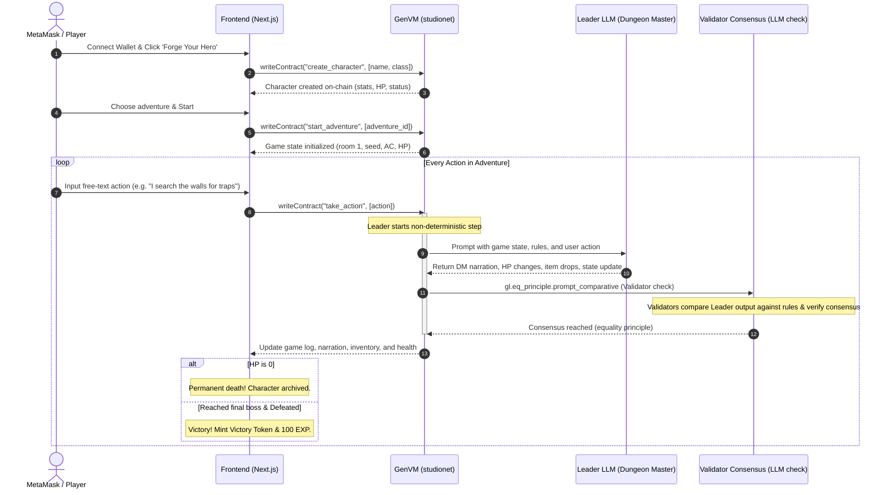

# GMaster — Decentralized AI Dungeon Master on GenLayer

[](https://studio.genlayer.com/explorer/address/0x4EF21aBF27b914Cbab5300DC51490A3a51E4cb40)
[](https://gmaster-genlayer.vercel.app/)

> *"In a realm where dice are cast by consensus and stories are sealed in stone, only the brave dare roll."*

**GMaster** is a full-stack Web3 dApp that brings D&D-style text adventures on-chain. Every action you take is narrated by an AI Dungeon Master, every dice roll is verified by validator consensus, and every triumph or tragedy is permanently recorded — impossible to cheat, impossible to save-scum.

---

### Deployed Addresses & Studio Explorer
- **Intelligent Contract Address:** [`0x4EF21aBF27b914Cbab5300DC51490A3a51E4cb40`](https://studio.genlayer.com/explorer/address/0x4EF21aBF27b914Cbab5300DC51490A3a51E4cb40)
- **Live Vercel Application:** [https://gmaster-genlayer.vercel.app/](https://gmaster-genlayer.vercel.app/)
- **GenLayer Studio Network (studionet) Explorer:** [GenLayer Studio Explorer](https://studio.genlayer.com/explorer)

---

## Features

- **AI Dungeon Master**: Free-form natural language actions interpreted by LLM
- **Trustless Dice**: RNG via deterministic LLM consensus (leader + validators)
- **Immutable History**: Every turn, every loot drop, every death — on-chain forever
- **3 Adventures**: Goblin Cave, Haunted Crypt, Dragon's Lair
- **Character Classes**: Warrior, Rogue, Mage, Cleric with unique stats
- **Item System**: Weapons, armor, consumables, treasure, victory tokens
- **Hall of Fame**: Browse victories, fallen heroes, and recent tales

---

## Architecture



---

## Game Rules Summary

**Stats**: STR, DEX, INT, WIS (8–18). Modifier = `(stat - 10) // 2`.

**Skill Check**: d20 + modifier vs DC (5/10/15/20/25). Natural 20 = critical success. Natural 1 = critical failure.

**Combat**: Attack d20 + STR/DEX mod vs monster AC. Damage = d6 + modifier. Player AC = 10 + DEX mod.

**Death**: HP reaches 0 → character dies permanently on-chain. Must create a new hero.

**Victory**: Defeat the boss in the final room → mint Victory Token + 100 EXP.

See `docs/GAME_RULES.md` for full details.

---

## Step-by-Step Deploy Guide

### Prerequisites
- Node.js 18+ & npm
- MetaMask browser extension

### Step 1: Deploy the Contract

1. Open **https://studio.genlayer.com/contracts**
2. Click **"New Contract"**
3. Paste the entire contents of `contracts/gmaster.py`
4. Click **"Deploy"** (no constructor args)
5. **WAIT 30–60 seconds**
   - If you see *"Contract Queues not found"* or *"RevealingPhase not found"*, that's a **transient consensus error** — NOT a code bug. Just retry the deployment.
6. Copy the contract address (looks like `0x...`)

### Step 2: Configure Frontend

```bash
cd frontend
cp .env.example .env
```

Open `.env` and paste your contract address:
```
NEXT_PUBLIC_CONTRACT_ADDRESS=0xYOUR_CONTRACT_ADDRESS_HERE
NEXT_PUBLIC_GENLAYER_NETWORK=studionet
```

### Step 3: Install & Run

```bash
npm install
npm run dev
```

Open **http://localhost:3000**

### Step 4: Connect Wallet

1. Open MetaMask
2. Add **GenLayer Studio** network:
   - Network Name: `GenLayer Studio`
   - RPC URL: `https://studio.genlayer.com/rpc`
   - Chain ID: `1234`
   - Currency Symbol: `GEN`
3. Connect your wallet on the site
4. **Create character → Start adventure → Play!**

---

## Troubleshooting

```
ERROR: "module 'genlayer.gl' has no attribute 'contract'"
  → Wrong syntax. Use `class X(gl.Contract):` not `@gl.contract` decorator.

ERROR: "TypeError: This class can't be created with TreeMap()" / "AssertionError: Is right the same storage type?"
  → Storage was initialized in __init__. Remove all such initializations.

ERROR: "Contract Queues not found" / "RevealingPhase not found"
  → Transient Studio consensus error. Retry. Not a code issue.

ERROR: Action transaction stuck >3 min
  → AI consensus pending. Normal for non-det operations.

ERROR: Different LLMs disagree → transaction undetermined
  → DM prompt needs tighter rules. Tighten output schema or simplify tolerance thresholds.
```

---

## Project Structure

```
bot AI/GMaster/
├── README.md
├── .gitignore
├── contracts/
│   └── gmaster.py              # GenLayer Intelligent Contract
├── tests/
│   └── test_gmaster.py         # gltest unit tests
├── frontend/
│   ├── .env.example
│   ├── package.json
│   ├── app/
│   │   ├── layout.tsx          # Fonts + theme + providers
│   │   ├── page.tsx            # Landing page
│   │   ├── tavern/page.tsx     # Character creation + adventure select
│   │   ├── adventure/[gameId]/page.tsx  # Main gameplay
│   │   ├── inventory/page.tsx  # Character sheet + items
│   │   └── hall-of-fame/page.tsx  # Leaderboard
│   ├── components/
│   │   ├── ConnectWalletButton.tsx
│   │   ├── CharacterCreator.tsx
│   │   ├── CharacterSheet.tsx
│   │   ├── AdventureSelector.tsx
│   │   ├── GameLog.tsx
│   │   ├── ActionInput.tsx
│   │   ├── DiceRollAnimation.tsx
│   │   ├── CombatPanel.tsx
│   │   ├── InventoryGrid.tsx
│   │   ├── ItemCard.tsx
│   │   ├── DeathScreen.tsx
│   │   └── VictoryScreen.tsx
│   └── lib/
│       ├── genlayer.ts         # SDK client + helpers
│       ├── contract-abi.ts     # ABI mirror
│       ├── game-types.ts       # TS types
│       └── utils.ts            # cn + helpers
└── docs/
    ├── ARCHITECTURE.md
    ├── GAME_RULES.md
    └── DM_PROMPT_DESIGN.md
```

---

## Tech Stack

| Layer | Technology |
|-------|-----------|
| Smart Contract | Python 3 + GenLayer SDK |
| Frontend | Next.js 14 (App Router) + TypeScript |
| Styling | TailwindCSS v4 + shadcn/ui |
| Wallet | MetaMask via `genlayer-js` |
| Animation | framer-motion |
| Toasts | sonner |
| Forms | react-hook-form + zod |

---

## Roadmap

- **v2**: Multi-player adventures (party of 4)
- **v2**: Trading items between players
- **v2**: Custom adventures via natural-language module submission
- **v3**: Lore from external wikis via `web.render` (Forgotten Realms, etc.)
- **v3**: Cross-character interactions (PvP duels)
- **v3**: Voice narration via TTS
- **v3**: Bring-your-own NFT items from other collections

---

## License

MIT — Forge your legend freely.
